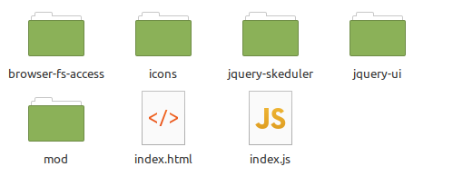

# LED sheduler

## 動作環境
1. Python3.7以上
2. ブラウザー
  - Chrome
  - Edge

## 追加パッケージ

1. websocket
~~~
pip install websocket
~~~

2. PySimpleGui
~~~
pip install PySimpleGUI
~~~

4. Phidget(DACドライバー)
~~~
curl -fsSL https://www.phidgets.com/downloads/setup_linux | sudo -E bash -
sudo apt update
sudo apt install libphidget22 install -y libphidget22
~~~

5. Phidget(DAC API)
~~~
pip install Phidget22
~~~

6. browser-fs-access(JS)
~~~
git clone https://github.com/GoogleChromeLabs/browser-fs-access.git
~~~

7. jquery-ui-1.13.2(JS)
~~~
git clone https://github.com/jquery/jquery-ui.git
~~~

## ディレクトリ構造
追加パッケージ(JS)は以下のように配置します。

## テスト  
1. ポート8000でHttpd起動
~~~
python -m http.server 8000
~~~
2. ドライバー起動
~~~
python drv/ledsch.py
~~~
3. ブラウザーでhttp://localhost:8000/ui/index.htmlに接続

## プロトコル  
[プロトコル仕様](PROTOCOL.md)
