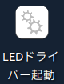
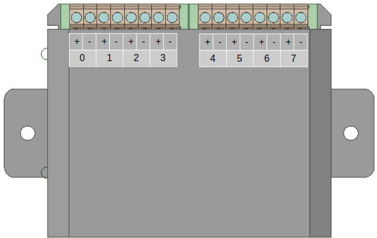

 2022.12

<h1>UV-LED調光システム 取扱説明書</h1>
 
 
 
 
 
 
 
 
 
 
 
 

<table>
<tr><th>版数<th>発行日<th>発行者<th width="50%">内容</tr>
<tr><td>第1版<td>2022.12.20<td>C.A.labs.<td>初版</tr>
<tr><td>-<td><td></tr>
<tr><td>-<td><td></tr>
</table>

## 目次
### 1. パッキングリスト
### 2. 設置
1. USBケーブルの接続
2. BNCケーブルの接続
### 3. システムの起動
1. ドライバーの起動
2. ユーザーインタフェースの起動
### 4. 操作
1. スケジュールの作成
2. 操作一覧
3. 状態表示一覧
### 5. リモート接続
### 補足
1. アナログ出力ボックスのピン割付
2. 部品リスト
3. システムブロック図

----
## [1] パッキングリスト

|名称|概要|数量|
|:---|:---|:---|
|①ノートPC|HP社製のWindowsPCです。必要なソフトウェアがインストールされています|1|
|②アナログ出力ボックス|4chのDAコンバータ(**Phidget社 型番1002**)を2枚内蔵したボックスです。|1|
|③USBケーブル|miniB型のUSBケーブルです。PCとアナログ出力ボックスを接続するケーブルです。|2|
|④BNCケーブル|アナログ出力ボックスとLEDコントローラ(お客様範囲)を接続するケーブルです。|8|

----

## [2] 設置
### ①USBケーブルの接続
アナログ出力ボックスに、2本のUSBケーブルの小さい方の端子(miniB端子)を接続します。大きい端子(A端子)側はPCでに接続します。
### ②BNCケーブルの接続
アナログ出力ボックスの端子台にBNCケーブルを固定します。端子台のピン割付はAppendix.1を参考にしてください。

----

##  [3] システムの起動

### ①PCの起動  
  PCの電源SWを入れて起動します。初期アカウントは以下に設定しています。
  - アカウント：naro
  - パスワード：naro
  - PIN：6267
### ②ドライバーの起動
  アナログ出力制御を行うソフトウェアを「ドライバー」とよびます。
  

  上のデスクトップアイコンをクリックし、ドライバーソフトウェアを起動します。起動に成功すると、以下のウィンドウが表示されます。
  

<table><tr><td width="80"><td>
  
  ドライバーの起動に失敗したときは右のポップアップが表示されます。
  起動に失敗した場合は、アナログ出力BOXのUSB接続を確認し、再起動します。
</table>

### ③ユーザインタフェースの起動
  本システムはユーザインタフェースにWebブラウザ(1)を用います。ブラウザーを起動し、アドレス **localhost:8000** に接続します。
  接続に成功すると以下の画面が表示されます。

<table>
<tr><td>①スケジュール表<td>スケジュール表は、「イベント」(後述)をチャンネルと時刻に応じて配置したものです。
<tr><td>②イベント<td>LED照度と切り替えの時刻を表したものです。
<tr><td>③ファイル操作パネル<td>作成したスケジュールを、ファイルに保存したり、ファイルから読出したりします。
<tr><td>④送受信操作パネル<td>作成したスケジュールを、ドライバーに送信したり、実行中のスケジュールをドライバーから読み出したりします。
<tr><td>⑤インジケータパネル<td>ドライバーとの接続状態を表示します。
<tr><td>⑥モニターパネル<td>ドライバーのモニターを行うパネル。上段の数値は、現在出力を%単位でリアルタイムに表示します。 
下段は強制出力値を設定します。チェックしたチャンネルは書き込まれたスケジュールを無視し、強制出力が行われます。
なお強制出力は、ユーザインタフェース(ブラウザー)がこのページから離れると、自動的に解除されます。
</table>
<table><tr><td width="80"><td>
 ドライバーに接続されると、インジケータパネルの接続アイコンがに変わります。接続されないときは、ブラウザーの「更新」ボタンでページを更新してください。
</table>

----

## [4] 操作
### ①スケジュールの作成
1. 新規イベントの作成  
イベント編集パネルの、イベントを追加したい空白の箇所をクリックすると、下記のポップアップが現れます。

時刻とデューティを入力します。

2. イベントの変更
イベント編集パネルの、イベントをクリックすると、下記のポップアップが現れ編集が可能となります。  
なお「削除」ボタンはイベントそのものを削除するので、ご注意ください。

3. スケジュールの実行
前述の1、2により作成されたスケジュールは、アイコンをクリックしてドライバーに送信されます。ドライバーは送られたスケジュールを即実行します。
<table><tr><td width="80"><td>
 アイコンが点滅しているときは、変更されたスケジュールが未送信であることを示しています。変更を取り消し、現在実行中のスケジュールに戻すときはアイコンをクリックします。
</table>

### ②操作一覧
1. ファイルの操作
<table>
<tr><td width="80"><td>現在のスケジュール表をファイルに保存します。
<tr><td><td>ファイルに保存されたスケジュールを表に読み込みます。操作
<tr><td width="80"><td>現在のスケジュール表をドライバーに送信します。
<tr><td><td>現在実行中のスケジュールを表に読み込みます。
</table>

### ③状態表示一覧
<table>
<tr><td width="80"><td>ユーザインタフェースはドライバに接続中です。
<tr><td><td>ユーザインタフェースはドライバに接続されていません。接続されていないとスケジュールをドライバーへ送信できません。
</table>

----

## [5]リモート接続
1. LAN接続
  リモートPCのから設定する場合は、先にPCのIPアドレスを手動にて設定します。
  以下、PCのアドレスを仮に **192.168.10.10** に設定したとして、説明します。

2. リポートPCからドライバーへの接続
  Webブラウザ(1)にて アドレス **192.168.10.10:8000** に接続します。
  接続されると、前述のユーザインタフェースと同じものが表示されます。同様の操作にて遠隔のドライバーを操作することが出来ます。

----

## 補足
### A.1 アナログ出力ボックスのピン割付

### A.2 部品リスト
①市販品
|名称|型式|メーカ|
|:---|:---|:---|
|ノートPC|HP 14s-fq0000|HP| 
|アナログ出力基板|Analog4Out|Phidget|
|USBケーブル|Type miniB|汎用品|
|BNCケーブル|TLBNC-PFRG-1.5D2V-3|ミスミ|

②特注品
|名称|型式|購入先|URL|
|:---|:---|:---|:---|
|基板ケース|PhidgetCase#2|C.A.labs|---|
|ソフトウェア|LedScheduler|C.A.labs|https://github.com/KazukiHiraizumi/LedScheduler|

### A.3 システムブロック図

