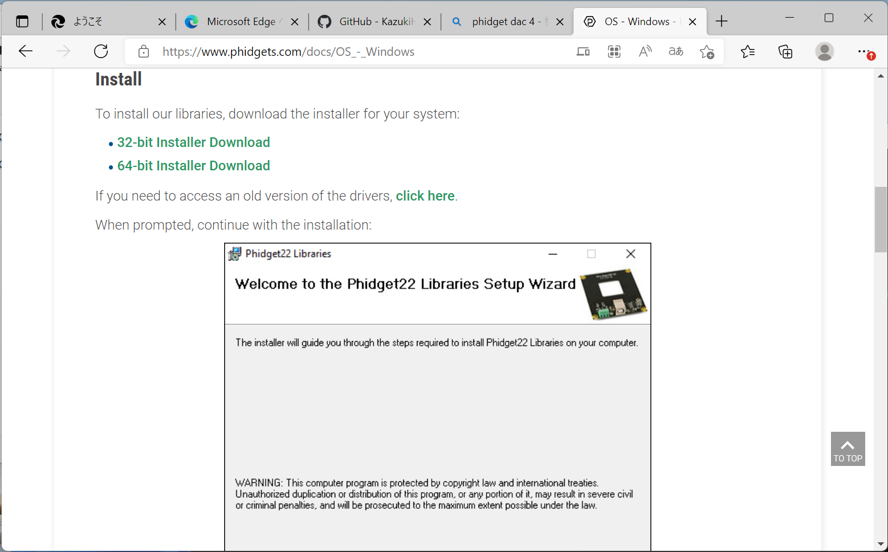
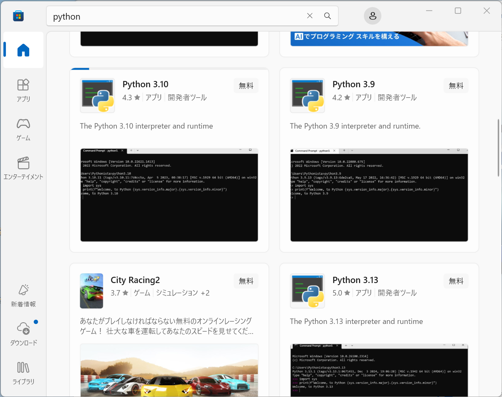

C.A.labs.

<h1>UV-LED調光システム Windows用セットアップ</h1>

<table>
<tr><th>版数<th>発行日<th>発行者<th width="50%">内容</tr>
<tr><td>1<td>2025.1.1<td>C.A.labs.<td>初版</tr>
<tr><td>-<td><td><td></tr>
<tr><td>-<td><td><td></tr>
</table>

----

## [1] Phidgetライブラリのインストール
1. メーカのサポートページ https://www.phidgets.com/docs/OS_-_Windows から、ライブラリをダウンロードします。  
[ライブラリPhidget22-x64.exe](https://cdn.phidgets.com/downloads/phidget22/libraries/windows/Phidget22-x64.exe)

2. ダウンロードしたexeファイルを実行し、インストールします。

----

## [2] Pythonのインストール
Pythonは、バージョン3.8以上がインストールされていれば、インストールの必要はありません。インストールされてなければ、MS-Storeからインストールします。

## [3] Pythonパッケージのインストール
コマンドプロンプトを開いて、以下のパッケージを追加します。
1. websockets
~~~
pip install websockets
~~~
2. TkEasyGUI
~~~
pip install TkEasyGUI
~~~
3. Phidget(DAコンバータ)
~~~
pip install Phidget22
~~~

